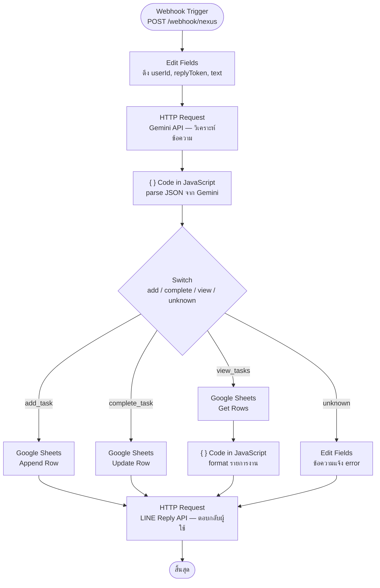
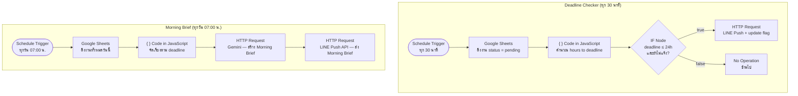

# Nexus AI — The Task-Life Harmonizer
 
บอทจัดการงานและ deadline อัตโนมัติผ่านแอปพลิเคชัน LINE พัฒนาด้วย n8n เพื่อช่วยให้นักศึกษาและวัยทำงานไม่พลาด deadline โดยไม่ต้องเฝ้าจำหรือจดไว้หลายที่
 
---
 
## Problem & Solution
 
- **ปัญหา:** ข้อมูลงานและ deadline กระจายอยู่หลายที่ทั้ง LINE chat, อีเมล และคำสั่งในห้องเรียน ทำให้ผู้ใช้เสียเวลาเฉลี่ย 15–30 นาทีต่อวันในการตรวจสอบ และมีความเสี่ยงส่งงานล่าช้าหรือพลาด deadline
- **ทางแก้:** ระบบ AI ที่รับข้อความภาษาธรรมชาติผ่าน LINE วิเคราะห์ด้วย Gemini AI สกัดข้อมูลงาน บันทึกลง Google Sheets และแจ้งเตือนอัตโนมัติเมื่อ deadline ใกล้เข้ามา
 
---
 
## System Architecture 
 
ระบบถูกออกแบบเป็น 2 Workflow บน n8n ดังนี้
 
### Workflow 1 — Main (รับ-ตอบ LINE)
 

 
---
 
### Workflow 2 — Scheduler (แจ้งเตือน deadline + Morning Brief)
 

 
---
 
## ตัวอย่างการใช้งาน
 
| ข้อความที่พิมพ์ | ผลลัพธ์ |
|---|---|
| `กำหนดส่งงาน Proposal CSI403 ภายในวันที่ 13 มี.ค.` | บันทึกงาน + ยืนยันกลับ |
| `ทำ Report CSI401 เสร็จแล้ว` | อัปเดตสถานะเป็น done |
| `มีงานอะไรบ้างวันนี้` | แสดงรายการงานวันนี้ทั้งหมด |
| `งานที่ใกล้ deadline` | แสดงงานที่ครบกำหนดภายใน 3 วัน |
 
---
