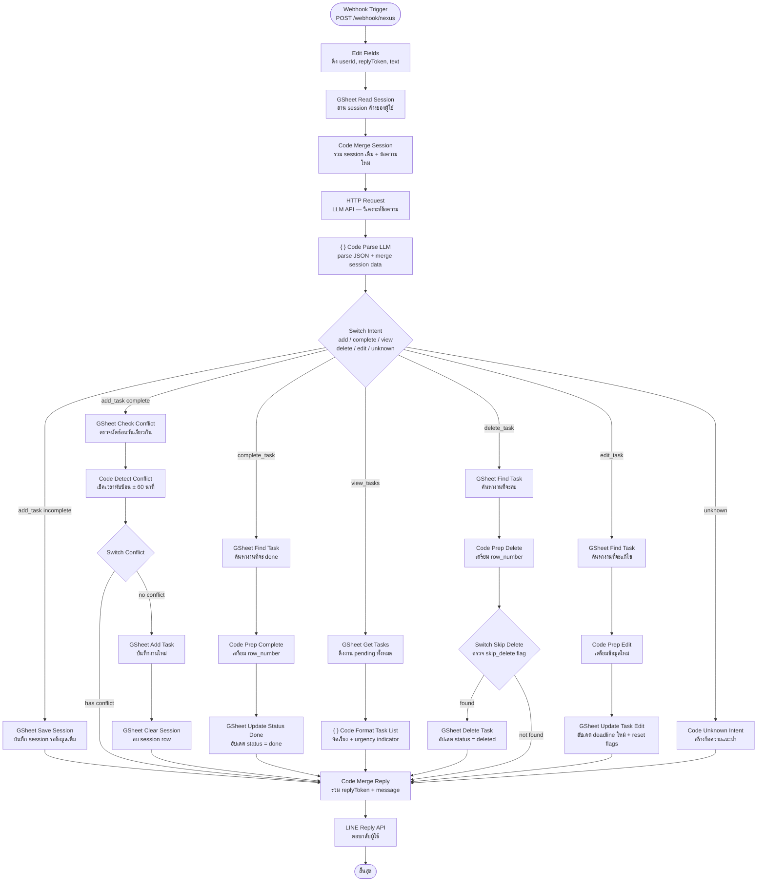
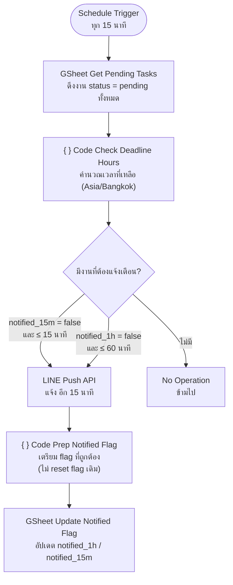
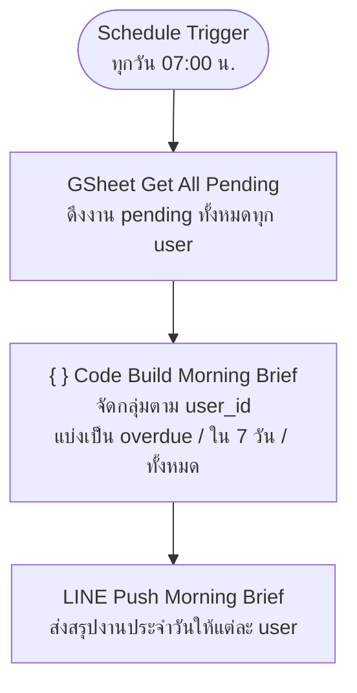

# Nexus AI — The Task-Life Harmonizer

บอทจัดการงานและ deadline อัตโนมัติผ่านแอปพลิเคชัน LINE พัฒนาด้วย n8n เพื่อช่วยให้นักศึกษาและวัยทำงานไม่พลาด deadline โดยไม่ต้องเฝ้าจำหรือจดไว้หลายที่

---

## Problem & Solution

- **ปัญหา:** ข้อมูลงานและ deadline กระจายอยู่หลายที่ทั้ง LINE chat, อีเมล และคำสั่งในห้องเรียน ทำให้ผู้ใช้เสียเวลาในการตรวจสอบ และมีความเสี่ยงส่งงานล่าช้าหรือพลาด deadline
- **ทางแก้:** ระบบ AI ที่รับข้อความภาษาธรรมชาติผ่าน LINE วิเคราะห์ด้วย LLM สกัดข้อมูลงาน บันทึกลง Google Sheets และแจ้งเตือนอัตโนมัติเมื่อ deadline ใกล้เข้ามา รองรับการสนทนาหลายรอบ (multi-turn) และตรวจจับนัดซ้อน (conflict detection)

---

## System Architecture

ระบบถูกออกแบบเป็น 3 Workflow บน n8n ดังนี้

### Workflow 1 — Main Chat Flow (รับ-ตอบ LINE)

---

### Workflow 2 — Deadline Checker (แจ้งเตือนทุก 15 นาที)

---

### Workflow 3 — Morning Brief (ทุกวัน 07:00 น.)

---

## ตัวอย่างการใช้งาน

| ข้อความที่พิมพ์ | ผลลัพธ์ |
|---|---|
| `กำหนดส่งงาน Proposal CSI403 ภายในวันที่ 13 มี.ค.` | บันทึกงาน + ยืนยันกลับ |
| `มีแข่ง 10 โมงพรุ่งนี้` | บันทึกงานประเภท Meeting พร้อมแจ้งถ้านัดซ้อน |
| `ทำ Report CSI401 เสร็จแล้ว` | อัปเดตสถานะเป็น done |
| `มีงานอะไรบ้าง` | แสดงรายการงาน pending ทั้งหมด พร้อม urgency |
| `เลื่อนงาน Proposal เป็นวันที่ 20` | แก้ไข deadline + reset การแจ้งเตือน |
| `ลบงาน Proposal` | ลบงานออกจากรายการ |

---

## การแจ้งเตือน

| ประเภท | เวลา | ช่องทาง |
|---|---|---|
| Morning Brief | ทุกวัน 07:00 น. | LINE Push |
| แจ้งเตือนก่อน 1 ชั่วโมง | ก่อน Deadline 1 ชั่วโมง | LINE Push |
| แจ้งเตือนก่อน 15 นาที | ก่อน Deadline 15 นาที | LINE Push |

> งานที่ไม่มีเวลา (`has_time = false`) จะใช้เวลา 07:00 น. เป็น default สำหรับการคำนวณ deadline

---
